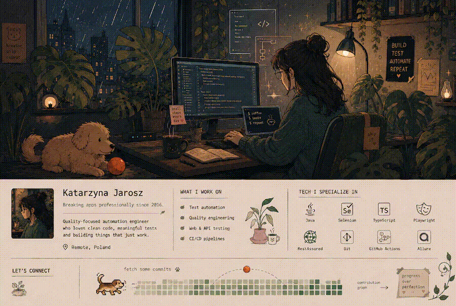

  

 

  <h1>Katarzyna Jarosz</h1>
  
<i>Designing automated systems that reduce noise and bring order to chaos.</i>

---

### 📝 The Logbook
For over seven years, I have been building and maintaining automation frameworks that act as the silent backbone for software teams. My work focuses on transitioning from manual processes to high-fidelity, maintainable automated suites. 

* **Focus:** Designing stable UI and API frameworks from the ground up.
* **Philosophy:** I believe quality is a shared team responsibility, not just a set of test cases.
* **Current Session:** Open to long-term, fully remote collaborations.

---

### 🛠 The Workbench
A curated selection of instruments used for testing, performance, and accessibility.

| Environment | Instruments |
| :--- | :--- |
| **Core Automation** | Playwright, TypeScript, Java, Selenium |
| **Integrations** | GitHub Actions, Docker, Jenkins, CI/CD Pipelines |
| **Quality Audits** | AI-Assisted Testing (MCP), a11y (Axe), Performance (Lighthouse) |
| **Data & Reports** | SQL, Allure, Playwright Reporter, Postman |

---

### 📌 Field Notes
*Selected repositories reflecting recent explorations.*

#### [gad-tests](https://github.com/bike7/gad-tests)
A modern framework for UI/API testing using **Playwright** and **TypeScript**. It features a Dockerized CI/CD pipeline and realistic data generation via Faker to ensure test suites remain readable and maintainable.

#### [gad-mcp-copilot](https://github.com/bike7/gad-mcp-copilot)
An experimental project exploring **AI-assisted testing**. This framework integrates **GitHub Copilot** and **Playwright MCP** to conduct non-functional audits, including accessibility and performance.

---

### 📖 Reflections
*My thoughts on the craft of software testing.*

* **[Neurodiversity in QA]**: [How Different Minds Elevate Software Quality](https://www.linkedin.com/pulse/neurodiverse-testers-how-different-minds-elevate-software-jarosz-vonvf/)
* **[Salesforce Testing]**: [Why Salesforce Automation is Harder Than It Looks](https://www.linkedin.com/pulse/why-salesforce-test-automation-harder-than-looks-katarzyna-jarosz-9tawf/)
* **[Interview Strategy]**: [Mastering the ‘Test This!’ Question](https://www.linkedin.com/pulse/mastering-test-question-qa-interviews-katarzyna-jarosz-3fkpf/)

---

### 🌱 Growth
Currently deepening my expertise in **Accessibility (a11y)**, **Performance**, and **Security** testing.

---

  
   
  
  

    <small><i>The dog is resting.</i></small> 
    <a href="https://www.linkedin.com/in/k-jarosz/">LinkedIn</a> • <a href="mailto:k.jarosz.interview@gmail.com">Email</a>
  

