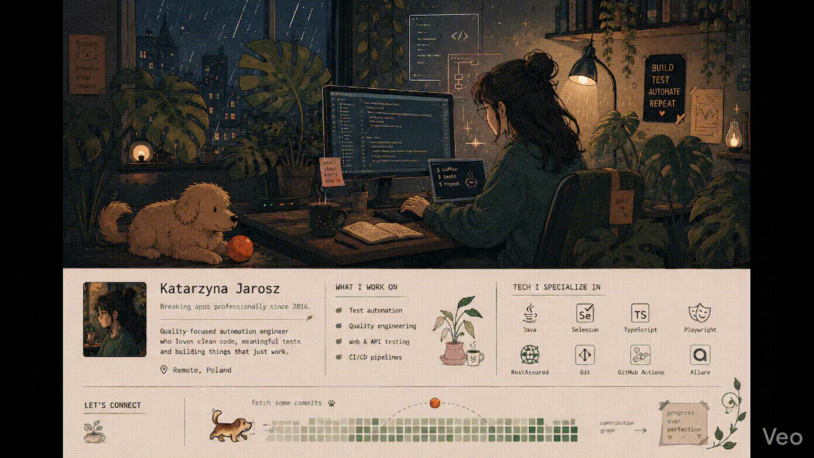

  

  <h1>Katarzyna Jarosz</h1>
  
<i>I believe good automation reduces chaos instead of creating it.</i>

---

## 👋 Operator Notes

I’ve been working in **software testing and automation for over 7 years**.  I started with manual testing and now design and maintain **automated testing frameworks**, mainly using **Playwright** and **TypeScript**.  I enjoy bringing order to chaotic test setups and building automation that genuinely **supports the team**.  I’m also interested in **CI/CD integration, security, performance and accessibility testing**.  I’m looking for a **long-term, fully remote project**.

---

## 🧪 Execution Layer

What I do:

- Perform manual testing and automated testing (UI and API)
- Migrate legacy automation (e.g. Selenium + Java → Playwright + TypeScript)
- Create stable, readable and maintainable test suites
- Build from scratch and refactor existing test automation frameworks
- Design, develop, maintain modern test automation frameworks
- Implement test reporting using Allure, Playwright built-in reporter or a tool of your choice
- Integrate and maintain CI/CD pipelines (Github Actions)
- Collaborate with international, fully remote teams
- Advocate for quality as a team responsibility, not just test cases
  
---

## 🛠 The Workbench

A curated set of tools, environments and practices used in daily testing and automation work:

- **Testing:** UI & API automation, E2E, integration, regression, exploration, manual testing
- **Programming Languages:** Java, TypeScript, JavaScript
- **UI & API Test Automation:** Playwright, Selenium, AccelQ, Postman, RestAssured, SQL, Swagger
- **AI & Accessibility:** Github Copilot, Playwright MCP, Axe, Lighthouse
- **IDE & Code Quality:** VSCode, IntelliJ IDEA, Eclipse, ESLint, Prettier, Husky, Dotenv
- **Plugins & Tools:** Faker, Jackson, Lombok, Hamcrest, AssertJ, TestNG, jUnit, Maven, Gradle
- **Version Control:** GIT, GitHub, GitLab, Bitbucket
- **CI/CD:** Jenkins, TeamCity, GitHub Actions
- **Reporting & BDD:** Allure, Cucumber, Gherkin
- **Issue Tracking**: Jira, Confluence, Pivotal Tracker, IBM Rational Change
- **Test Management:** Xray, TestRail, TestArena, IBM Rational Doors, HP ALM
- **Methodologies:** Agile, Scrum, SAFe, Waterfall
- **Languages:** English (professional proficiency), Polish (native proficiency)

---

## 📌 Field Notes

Selected repositories reflecting applied engineering work.

### 🔹 **[gad-tests](https://github.com/bike7/gad-tests)**

Modern Test automation framework for UI and API testing of the GAD application using Playwright and TypeScript. The framework follows Page Object Model and Arrange–Act–Assert patterns, uses fixtures and method chaining for readability. It generates realistic test data with Faker, enforces high code quality through ESLint, Prettier, Husky and Dotenv and includes two GitHub Actions CI/CD pipelines. One pipeline provisions the application under test using a prebuilt Docker image including all required services while the second pipeline clones the application source repository, builds it and starts the application as part of the CI workflow.

Tests status: 

Link to the report: 🎭[Playwright Report](https://bike7.github.io/gad-tests/)

### 🔹 **[gad-mcp-copilot](https://github.com/bike7/gad-mcp-copilot)**

Experimental, lightweight test automation framework created to demonstrate AI-assisted testing possibilities using Playwright, Typescript, GitHub Copilot and Playwright MCP. It includes functional tests (smoke, integration, end-to-end) with Allure reporting, as well as non-functional testing such as Playwright visual testing, accessibility audits with Axe and accessibility/performance audits with Google Lighthouse. Detailed and consolidated Axe and Lighthouse reports are generated for all main pages.

Functional tests status:  

Links to reports:
🎭[ Playwright report ](https://bike7.github.io/gad-mcp-copilot/playwright/functional)
📄[ Allure Report ](https://bike7.github.io/gad-mcp-copilot/allure/)

Non-functional tests status: 

Links to reports:
🎭[ Playwright report ](https://bike7.github.io/gad-mcp-copilot/playwright/nonfunctional)
🪓[ Axe Accessibility Report ](https://bike7.github.io/gad-mcp-copilot/accessibility/)
🗼[ Google Lighthouse Accessibility/Performance Report ](https://bike7.github.io/gad-mcp-copilot/lighthouse/)

---

## 📝 Reflections

Check out some of my LinkedIn articles:

- [Mastering the ‘Test This!’ Question in QA Interviews](https://www.linkedin.com/pulse/mastering-test-question-qa-interviews-katarzyna-jarosz-3fkpf/?trackingId=eaha4W%2FAQ%2BetEy2JMiD7jg%3D%3D)  
"Test THIS!" is one of the most popular tasks that appear during a QA job interview. I’ve encountered it personally as well. The “this” can be any object within the recruiter’s view: a pen, a whiteboard eraser, a coffee mug – the possibilities are endless.

- [Why Salesforce Test Automation Is Harder Than It Looks?](https://www.linkedin.com/pulse/why-salesforce-test-automation-harder-than-looks-katarzyna-jarosz-9tawf/?trackingId=eaha4W%2FAQ%2BetEy2JMiD7jg%3D%3D)  
On paper, automating Salesforce tests sounds like any other web automation project - log in, click through some workflows, verify results. In reality, it’s anything but simple.

- [Neurodiverse Testers: How Different Minds Elevate Software Quality](https://www.linkedin.com/pulse/neurodiverse-testers-how-different-minds-elevate-software-jarosz-vonvf/?trackingId=eaha4W%2FAQ%2BetEy2JMiD7jg%3D%3D)  
 Let’s talk about how neurodiversity transforms IT teams and software testing. When people with different thinking styles collaborate, the outcome is often richer, more innovative, and more resilient than what a uniform team can achieve.

---

## 🌱 Currently Growing In

- Accessibility testing (a11y)
- Performance testing
- Security testing
- Building more resilient automation systems

---
